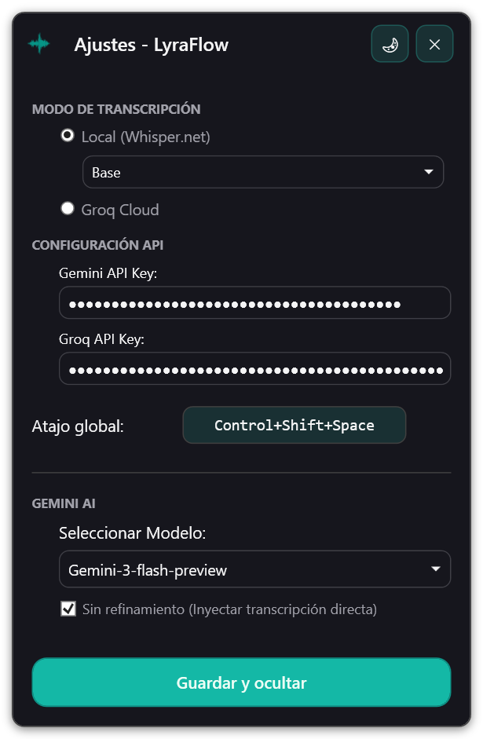
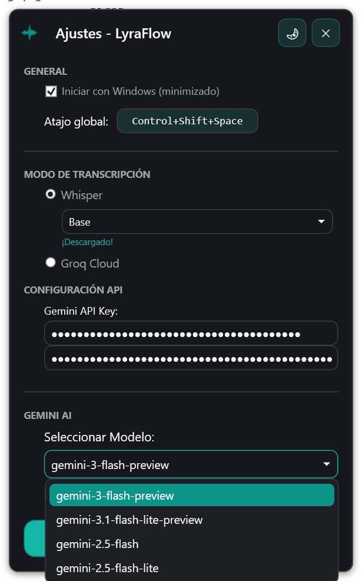

# LyraFlow 🎙️✨

**LyraFlow** es una herramienta de dictado inteligente de "Inyección Directa" que transforma tu voz en texto refinado y profesional al instante. Elimina la fricción de escribir, dictando tus ideas para que aparezcan perfectamente puntuadas y estructuradas en cualquier aplicación de Windows.

<p align="center">
  &nbsp;&nbsp;&nbsp;
  
</p>

## 🚀 Características Principales

- **Inyección Silenciosa Directa**: El texto aparece donde está tu cursor de forma instantánea.
- **Inyección Anti-AutoSend**: Usa `Shift+Enter` para preservar párrafos y listas sin disparar el envío automático en aplicaciones de chat (WhatsApp, Telegram, Discord).
- **Inicio Automático con Windows**: Opción "General" para iniciar LyraFlow al arrancar el sistema, minimizado directamente en el system tray.
- **Gestor de Modelos Local**: Descarga y selecciona entre diferentes modelos de Whisper (Tiny, Base, Small, Medium) con una barra de progreso integrada.
- **Panel de Configuración Inteligente**: Gestiona tus API Keys de **Gemini** y **Groq** con persistencia local segura y una interfaz reorganizada para mayor claridad.
- **Transcripción Híbrida**:
  - **Local (Whisper.net)**: Privacidad total. Elige el modelo que mejor se adapte a tu hardware.
  - **Nube (Groq API)**: Transcripción ultra-rápida usando `whisper-large-v3-turbo`.
- **Refinamiento con Gemini AI**: Corrige gramática, puntuación y estilo automáticamente.
- **Contexto AI (`context.md`)**: Define reglas, tareas y restricciones específicas para que la IA escriba exactamente como tú necesitas.
- **Diseño Premium**: Interfaz minimalista en turquesa con modo oscuro/claro dinámico.
- **Diálogo de Salida Inteligente**: Panel de confirmación para **Ocultar** o **Salir**, con cierre por clic exterior o tecla `Esc`.
- **Atajo Global**: Control total con una combinación de teclas personalizable (Ej: `Ctrl+Shift+Espacio`).

## 🛠️ Requisitos
- **OS**: Windows 10/11.
- **Framework**: .NET 10.0 (WPF).
- **API Keys**: Necesitas llaves de [Google Gemini](https://aistudio.google.com/) y [Groq](https://console.groq.com/) para funciones completas.

## ⚙️ Configuración y Uso

1. **Compilar y Ejecutar**:
   ```ps1
   dotnet run
   ```
2. **Modelos Locales**: En la pestaña ajustes, selecciona un modelo y pulsa **DESCARGAR**. Se guardará en la carpeta local y se ignorará automáticamente en Git para mantener el repo ligero.
3. **API Keys**: Introduce tus llaves en el panel; se guardan de forma privada en `%LOCALAPPDATA%\LyraFlow\config.json`.
4. **Contexto (`context.md`)**: Configura aquí las reglas de "negocio", glosarios y ejemplos para que la IA escriba exactamente como tú lo harías.

---
*v1.0 - Primera Versión Principal | Desarrollado para maximizar tu productividad vocal.*
